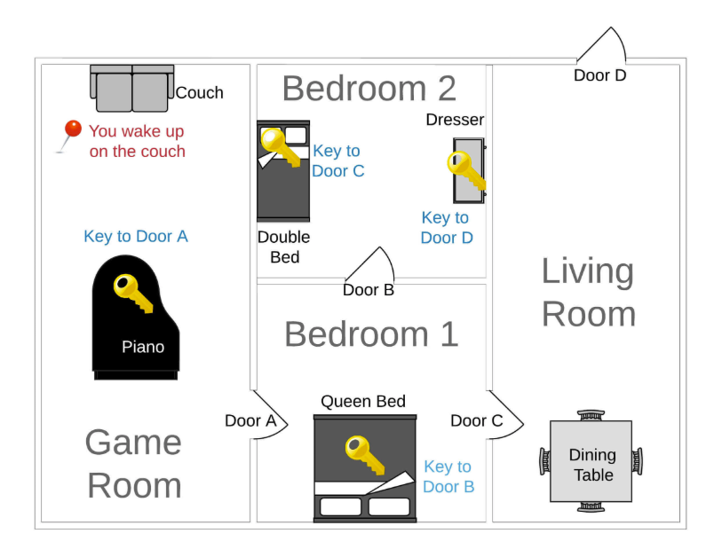

# Overview
The goal of the game is to escape the "haunted house" by exploring rooms, collecting keys and unlocking doors before time runs out.

## Link to Google Slides:
https://docs.google.com/presentation/d/1uJtU7mufu6laVFyhtom0WL45UFHwjR2UI1SX4Ev-JtQ/edit?usp=sharing
#
# Game Structure
# Content
The game is built using Python data structures and functions.
## Main components:
1. Dictionaries represent rooms, furniture, doors and keys
2. object_relations connects rooms, items and doors
3. game_state tracks player progress

## Game Control Flow
The game flow is controlled through functions:
1. start_game() → initializes the game and timer
2. play_room() → controls player actions
3. explore_room() → lists items in the room
4. examine_item() → interacts with objects
5. get_next_room_of_door() → handles room navigation

## Features implemented:
1. Room exploration
2. Key collection system
3. Door unlocking mechanics
4. Navigation between rooms
5. :hourglass_flowing_sand: Timer system
